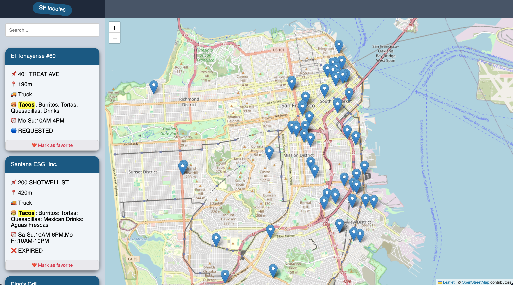

# SF food trucks

A small web application written in NextJS that allows the user
to search food trucks near in San Francisco

## Some features

- Food truck querying uses file streaming, allowing large files to be processed without fully loading them in memory
- Open Leaflet map is used to render the food trucks positons
- React Suspense is used to partially render the page while data is still fetching
- The user can mark certain places as favorites, this gets stored in the local storage
- The search highlights the matched text as a visual help
- The search is implemented using URL search params so it is persisted across reloads

## Next steps

- Allow the user to select its own position (for now it is fixed)
- Load more food truck places across the world using a database such as PostgreSQL and geohashes for high performance search
- Allow the user to login and save its own favorites across computers
- Use google routing APIs to show the user a more accurate travel distance, not just euclidean distance

## Screenshot



# How to run

Install packages:

```
npm install
```

Run the web app:

```
npm run dev
```

Open http://localhost:3000/
